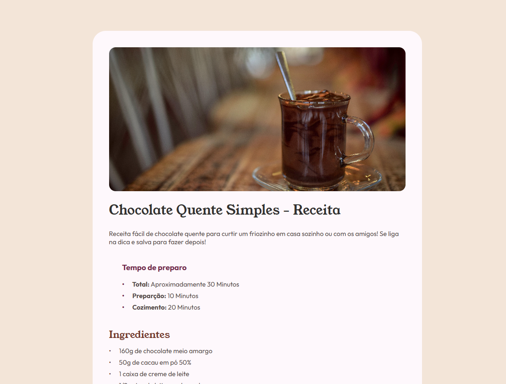

# 🍫 Recipe Page - Chocolate Quente

Este é um desafio do [Frontend Mentor](https://www.frontendmentor.io/challenges/recipe-page-KiTsR8QQKm) desenvolvido por mim.  
O objetivo era criar uma página de receita simples e responsiva, aplicando boas práticas de HTML e CSS.

---

## 📸 Screenshot

---

## 🚀 Tecnologias utilizadas

- **HTML5**  
- **CSS3**  
- **Google Fonts (Outfit & Young Serif)**  
- **Flexbox & Responsividade (Media Queries)**  

---

## 🔗 Links

- [Desafio no Frontend Mentor](https://www.frontendmentor.io/challenges/recipe-page-KiTsR8QQKm)  
- [Meu perfil no GitHub](https://github.com/lucaslehm)  
- [Deploy do projeto](https://fem-01-recipe-page.vercel.app/)

---

## 📚 O que aprendi

- Trabalhar melhor com **estrutura semântica no HTML**  
- Criar **listas customizadas** com bullets estilizados  
- Melhorar o uso de **variáveis CSS** para paleta de cores  
- Aplicar **responsividade** com media queries  

--- 

## 👨‍💻 Desenvolvido por

[Lucas Lehm](https://github.com/lucaslehm)  
